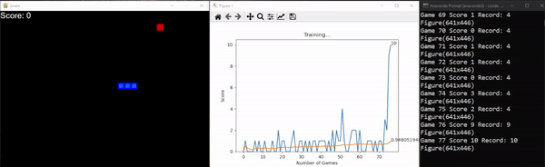
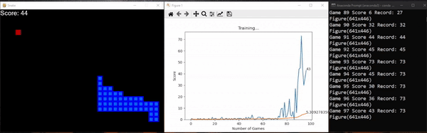

# Reinforcement Learning Snake Game - DQN
By [Sudharsan Ananth](https://sudharsanananth.wixsite.com/sudharsan) 

<!-- TABLE OF CONTENTS -->
<details>
  <summary>Table of Contents</summary>
  <ol>
    <li><a href="#introduction">Introduction</a></li>
    <li><a href="#dependencies">Dependencies</a></li>
    <li><a href="#prerequisites">Prerequisites</a></li>
    <li><a href="#run-the-game">Run the game</a></li>
    <li><a href="#license">License</a></li>
  </ol>
</details>


## Introduction 

In this project I have created a DQN agent to train in a snake game environment. The objective of the snake is to collide(eat) all the food that is placed randomly in the environment. 

### Untrained agent.

### Trained agent.


## Dependencies 

This project is built with the below given major frameworks and libraries. The code is primarily based on python. And the environment is created using Anaconda. 

* [Python](https://www.python.org/)
* [Anaconda](https://www.anaconda.com/)
* [pytorch](https://pytorch.org/)
* [matplotlib](https://matplotlib.org/)
* [Pygame](https://www.pygame.org/news)

## Prerequisites 

1. Python 3.7 (skip if downloading conda)
2. Conda (Either [miniconda](https://docs.conda.io/en/latest/miniconda.html) or [Ananconda](https://www.anaconda.com))

## Run the game

Simply clone the repo cd into the right directory and run agent using the below commands. Step-by-Step instructions given below. Simply change the directory and run `agent.py` from the directory `RL_car_game`. You will be able to see the agent training and getting better in minutes. 

1. Clone the repository using 
   ```sh
   git clone https://github.com/sudharsan-007/RL-DQN-Snake-Game.git
   ```

2. cd into the directory RL-DQN-Snake-Game
   ```sh
   cd RL-DQN-Snake-Game
   ```

3. Recommended: create a conda environment 
    ```sh
    # We require python>=3.7
    conda create -n rl_snake_game python=3.7 numpy matplotlib 
    conda activate rl_snake_game
    ```

4. Install pygame
   ```sh
   pip install pygame
   ```

5. Install pyTorch (CPU verison). Please refer pytorch website to get right version for GPU. 
    ```sh
    # https://pytorch.org/get-started/locally/
    conda install pytorch torchvision torchaudio cpuonly -c pytorch
    ```
6. If the above code does not work for you try this(skip this step 5 worked). 

    ```sh
    pip3 install torch torchvision torchaudio
    ```

6. Run `agent.py` from this directory and from inside this environment
   ```sh 
   python agent.py
   ```

7. To run the environment without Reinforcement Agent and the agent controllable by WASD keys
    ```sh 
    python snake_game.py
    ```

<!-- LICENSE -->
## License

Distributed under the MIT License. See `LICENSE.txt` for more information.

<p align="right">(<a href="#top">back to top</a>)</p>